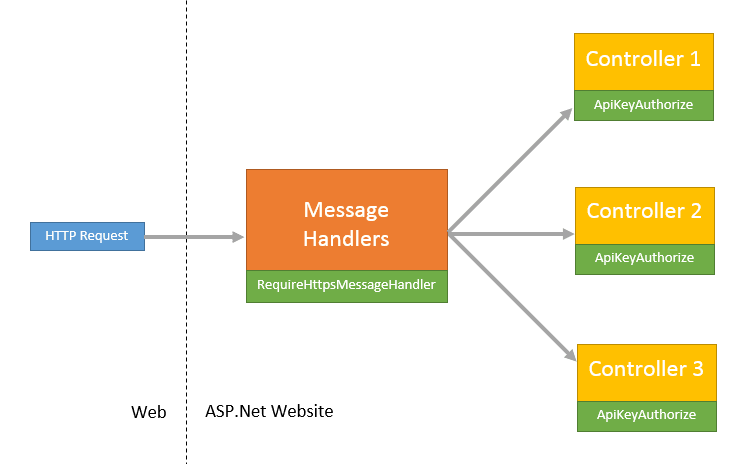

Implement simple authorization for ASP.NET Web API
==
*Written on the 8th of March 2014.*

For a recent Windows Phone project I had the need of a web API that would do some processing for the mobile app. Thanks to the simplicity of ASP.NET Web API I was able to get my web service running in just a few hours. But then an issue remained: the website being deployed on Azure, the API endpoint was public. Despite the genericity of my API I wanted to be able to restrict its access only to trusted clients.

After a bit of research and some [StackOverflow][1] help, I found a satisfiying solution. A really simple mix of ASP.NET message handlers, authorization filter and API keys.

### The big picture

To build this authorization system I had 2 main requirements: reasonable security and simplicity. It is well known that those rarely play well together but with no confidentiality involved, extra hard security was not necessary.

The main idea was to create an authorization filter that would lookup inside the `HttpRequest` for a specific header containing a unique API key. But the flaw in this concept is that anyone listenning to the network could find the request and extract the API key header to make its own requests. Thefore I added a message handler to force clients to communicate through HTTPS. This solution was a perfect fit for my requirements.



### Requiring SSL

First step, develop a simple message handler so we can filter out requests that are not using SSL encryption before they hit your controller.

```csharp
public class RequireHttpsMessageHandler : DelegatingHandler
{
    protected override Task<HttpResponseMessage> SendAsync(HttpRequestMessage request, CancellationToken cancellationToken)
    {
        if (request.RequestUri.Scheme != Uri.UriSchemeHttps)
        {
            var forbiddenResponse = request.CreateResponse(HttpStatusCode.Forbidden);
            forbiddenResponse.ReasonPhrase = "SSL Required";
            return Task.FromResult<HttpResponseMessage>(forbiddenResponse);
        }

        return base.SendAsync(request, cancellationToken);
    }
}
```

Don't forget to register the handler in the `WebApiConfig` startup class. From now on, every request that are not using the HTTPS protocol will be rejected with a `Error 403: SSL Required` response.

### Provide an API key store

Before creating an authorization filter to filter out the clients, we first need to get a token provider that will help us to retrieve trusted client API keys. To achieve that we will use the repository pattern so we can easily abstract and test our token provider.

```csharp
public interface IApiKeyProvider
{
    string GetApiKey();
}
```

For the simplicity of this demonstration we will implement a really simple API key provider storing a token as a constant. **Of course this not a recommended implementation!**

```csharp
public class SimpleApiKeyProvider : IApiKeyProvider
{
    private const string ApiKey = "iL0UCJtAwwq8nVjvUJoVkM9CjFhyycLp";

    public string GetApiKey()
    {
        return ApiKey;
    }
}
```

Again here don't forget to register your API key provider inside the dependency injection container of your choice. My personal choice is Unity for Web API which you can find on [NuGet][2].

### Filter the requests

Now it is time to implement the `ActionFilterAttribute` that we will use to verify client authorization before execution of controllers and individual actions.

```csharp
public class ApiKeyAuthorizeAttribute : ActionFilterAttribute
{
    private const string ApiKeyHeaderName = "ApiKey";

    public override void OnActionExecuting(HttpActionContext filterContext)
    {
        // Get API key provider
        var provider = filterContext.ControllerContext.Configuration
            .DependencyResolver.GetService(typeof(IApiKeyProvider)) as IApiKeyProvider;

        // Get ApiKey header data
        IEnumerable<string> apiKeys;
        filterContext.Request.Headers.TryGetValues(ApiKeyHeaderName, out apiKeys);

        // Check API key
        if (apiKeys == null || apiKeys.FirstOrDefault() != provider.GetApiKey())
        {
            filterContext.Response = new HttpResponseMessage(HttpStatusCode.Unauthorized);
        }

        base.OnActionExecuting(filterContext);
    }
}
```

The first thing to do on filter execution is to retrieve our API key store instance from the DI container. Using a service locator for resolving instances is a DI anti-pattern but thankfully ASP.NET provides a generic `DependencyResolver` that helps abstracting away the DI container implementation. Even though generic resolvers are also often considered an anti-pattern, they greatly reduces the shortcomings of using a service locator.

Then we try to extract the token from the request header and finally check it against our API key provider using the `GetApiKey()` method. In case the header is not present or does not match the expected token we simple return a `Unauthorized` status code.

### Applying authoritzation

Now that we have all our building blocks together, we will need to decorate the controllers and/or actions for which we want to restrict access to token holders. It is that simple.

```csharp
[ApiKeyAuthorize]
public class GreetingController : ApiController
{
    // GET api/greeting
    public string Get()
    {
        return "Hello World!";
    }
}
```

Here is how you would make an authorized HTTP request for calling this demonstration API.

```http
GET https://localhost:44301/api/greeting HTTP/1.1
ApiKey: iL0UCJtAwwq8nVjvUJoVkM9CjFhyycLp
```

### Conclusion

As we have seen applying a simple and easy access restiction on your ASP.NET Web API endpoints does not require a huge effort and will actually do the trick for most clients. In the end the most sophisticated part will reside in how you decide to implement API key distribution through your `IApiKeyProvider` implementation.

You can get the demo project from the [code folder][3].

[1]: http://stackoverflow.com/q/21796688/182438
[2]: http://www.nuget.org/packages/Unity.WebAPI
[3]: code
